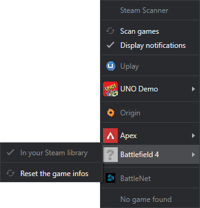
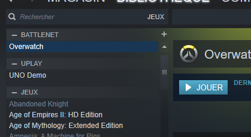

<center>
    <h1>Steam Scanner</h1>
    

[](https://github.com/nj-neer/Steam-Scanner/releases/latest)
[](https://ci.appveyor.com/project/Cyriaqu3/steam-scanner)

</center>

Get all you games on Steam ! Steam Scanner run as a background process, grab games from others launchers and add them to your Steam library.

|          In system tray           |          Result in Steam           |
| :-------------------------------: | :--------------------------------: |
|  |  |

| Table of contents                       |
| --------------------------------------- |
| [Downloads](#downloads)                 |
| [Supported OS](#supported-os)           |
| [Supported DRM](#supported-drm)         |
| [Dev prerequisites](#dev-prerequisites) |
| [Developping](#developping)             |
| [Launch parameters](#launch-parameters) |
| [DRM config file](#drm-config-file)     |
| [Known bugs](#known-bugs)               |

## Downloads

### Go to the **[Releases](https://github.com/nj-neer/Steam-Scanner/releases/latest)** section

## Supported OS

For now only **Windows** is supported

## Supported DRM

| DRM                                                                               | Supported |
| --------------------------------------------------------------------------------- | --------- |
|  Uplay      | ✔️        |
|  Origin     | ✔️        |
|  BattleNet  | 🔁 WIP    |
|  GOG Galaxy | ❌        |
|  Twitch DA  | ❌        |
|  MS Store  | ❌        |

## Dev Prerequisites

- [Yarn](https://yarnpkg.com/lang/en/docs/install) (using npm cause [issues with native dependencies building](https://github.com/electron-userland/electron-builder/issues/1147#issuecomment-276284477))

- [Gulp](https://gulpjs.com/)
- [Electron](https://electronjs.org/)
- [Python 2.7](https://www.python.org/downloads/)

_For windows, as admin_

```
npm install --global --production windows-build-tools
```

## Developping

Install the dependencies and generate the dist folder

```
yarn
```

Start the watcher

```
yarn run dev
```

### Launching the app (dev mode)

```
electron dist/app.js
```

### Building

```
yarn run build
```

**note :** Yarn doesn't show detailled error messages, use the vanilla command (ex: electron-builder") to display the full error if the build fail

### Deploy a release

**note** You need to create a file named **.gh-token** with the Github release token in it

```
yarn run deploy
```

## Launch parameters

The following launch parameters are available :

|           |                                                             |
| --------- | ----------------------------------------------------------- |
| - - clean | Clear the saved config and all shortcuts saved on Steam     |
| - - debug | Show additionnal outputs in the console (like updater logs) |

## DRM config file

_/src/drm.json_

**drm.json** contain the configuration used to find the DRM and to overrides some default behaviour (like choosing a game executable by default)

It contain an array of **Drm Object**

#### DRM Object

|        property         |         type         | default | required | notes                                                                                                                  |
| :---------------------: | :------------------: | :-----: | :------: | ---------------------------------------------------------------------------------------------------------------------- |
|          name           |        string        |         |   true   | Name of the DRM                                                                                                        |
|       binaryName        |  string (fileName)   |         |   true   | Name of the executable of the DRM                                                                                      |
| binaryPossibleLocations |    string(path)[]    |         |   true   | Array of path where **binaryName** may be found, use the **$drive** string to tell the scanner to search on each drive |
| gamesPossibleLocations  | gameLocationObject[] |         |   true   | See **GameLocationObject** below                                                                                       |

#### GameLocationObject

|     property     |     type     | default | required | notes                                                                                                     |
| :--------------: | :----------: | :-----: | :------: | --------------------------------------------------------------------------------------------------------- |
|       path       | string(path) |         |   true   | Path where the folder may be found, use the **$drive** string to tell the scanner to search on each drive |
| uniqueGameFolder |   boolean    |  false  |  false   | If **true**, the folder will be treated as a game folder (and not a list of game folders)                 |
|     userSet      |   boolean    |  false  |  false   | If true, the shortcut has been set manually by the user and all other rules are ignored                   |

## Known bugs

- Games are added multiple times
