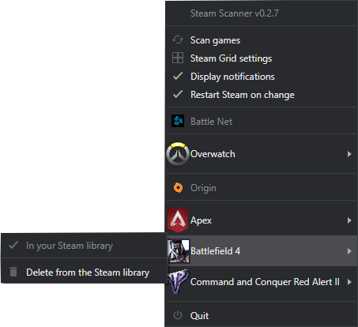

# Steam Scanner


[](https://ci.appveyor.com/project/Cyriaqu3/steam-scanner)
[](https://codeclimate.com/github/Ciriak/Steam-Scanner/maintainability)

### Get all you games on Steam ! 

Steam Scanner run as a background process, grab games from others launchers and add them to your Steam library.

It is available from the system tray



| Table of contents                        |
| ---------------------------------------- |
| [Downloads](#downloads)                  |
| [Supported OS](#supported-os)            |
| [Supported Launcher](#supported-drm)     |
| [Dev prerequisites](#dev-prerequisites)  |
| [Scripts](#scripts)  |
| [Known bugs](#known-bugs)                |

## Downloads

### Go to the **[Releases](https://github.com/nj-neer/Steam-Scanner/releases/latest)** section

## Supported OS

Only **Windows** is supported

## Supported Launcher

| Launcher                                                                          | Supported |
| --------------------------------------------------------------------------------- | --------- |
|  Uplay      | ✔️        |
|  Origin     | ✔️        |
|  BattleNet  | 🔁 WIP    |
|  GOG Galaxy | ❌        |
|  Twitch DA  | ❌        |
|  MS Store  | ❌        |

## Dev Prerequisites

_For windows, as admin_

```
npm install --global --production windows-build-tools
```

## Scripts

### `npm run dev`

Launch webpack and watch for changes

### `npm run electron`

Run the compiled app from the **`dist`** folder

### `npm run build`

Build the app and a setup executable

### `npm run clean`

Clean the **`dist`** and **`build`** folders


## Launch parameters (WIP)

The following launch parameters are available :

|           |                                                             |
| --------- | ----------------------------------------------------------- |
| - - clean | Clear the saved config and all shortcuts saved on Steam     |
| - - debug | Show additionnal outputs in the console (like updater logs) |


## Known bugs

- ()
